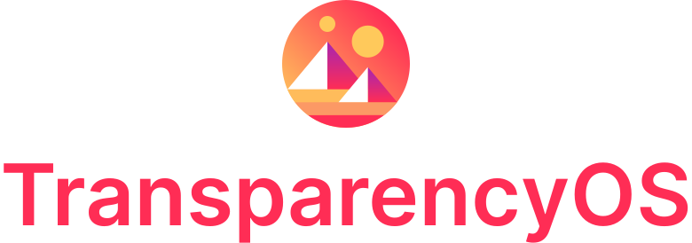

<div align="center">
    <br/>
    <strong>A set of tools to collect and process Decentraland's data into actionable insights.</strong>
</div>

---

## How it works

- All data is collected from public sources (e.g. blockchain networks, indexing services, and governance APIs).
- Scripts run on a daily schedule and publish raw data as CSV and JSON files to GitHub Pages.
- Data is also synced to Google Sheets and Google Data Studio for further analysis.

## Design Principles

- **Accessible** — Data is published in multiple formats (CSV, JSON, Google Sheets, Data Studio).
- **Auditable** — Open-source code with public workflow run logs.
- **Simple** — Easy to understand and easy to contribute.

---

## Output Formats

| Format | Link |
|--------|------|
| Transparency Page | [governance.decentraland.org/transparency](https://governance.decentraland.org/transparency/) |
| Google Data Studio | [Report Dashboard](https://datastudio.google.com/u/3/reporting/fca13118-c18d-4e68-9582-ad46d2dd5ce9/page/p_hc6ik7jerc) |
| Google Sheets | [Spreadsheet](https://docs.google.com/spreadsheets/d/1FoV7TdMTVnqVOZoV4bvVdHWkeu4sMH5JEhp8L0Shjlo/edit?usp=sharing) |
| Raw CSV / JSON | [gh-pages branch](https://github.com/Decentraland-DAO/transparency/tree/gh-pages) |
| Workflow Logs | [GitHub Actions](https://github.com/Decentraland-DAO/transparency/actions) |

---

## Data Sources

| Script | Description |
|--------|-------------|
| `export-proposals.ts` | Governance proposals from the Decentraland governance dApp and Snapshot |
| `export-votes.ts` | Snapshot votes with per-source voting power (MANA, LAND, NAMES, delegated, etc.) |
| `export-members.ts` | DAO community members (via Snapshot + The Graph) |
| `export-financials.ts` | Financial records from the governance dApp |
| `export-balances.ts` | DAO wallet token balances (via Alchemy + CoinGecko) |
| `getAllTransactions.ts` | On-chain token transfers by year (Ethereum + Polygon via Alchemy) |
| `export-collections.ts` | Decentraland wearable collections |
| `export-wearables.ts` | Individual wearable items |
| `export-curations.ts` | Curation committee activity |
| `export-teams.ts` | DAO team and committee members |
| `export-budgets.ts` | DAO budget allocations |
| `export-report.ts` | Governance report generation (EJS template) |
| `export-api-v2.ts` | Aggregated API v2 JSON output (`public/api-v2.json`) |

---

## Third-Party Providers

| Provider | Purpose |
|----------|---------|
| [Alchemy](https://www.alchemy.com/) | Ethereum & Polygon RPC and token transfer data |
| [Snapshot](https://snapshot.org/) | Off-chain governance voting |
| [The Graph](https://thegraph.com/) | Indexed blockchain data |
| [CovalentHQ](https://www.covalenthq.com/) | Token transfers and balance history |
| [CoinGecko](https://www.coingecko.com/) | Historical token prices |
| [Rollbar](https://rollbar.com/) | Error monitoring |

---

## Prerequisites

- [Node.js](https://nodejs.org/) v22 or higher
- `npm` (bundled with Node.js)

---

## Setup

### 1. Clone the repository

```bash
git clone https://github.com/Decentraland-DAO/transparency.git
cd transparency
```

### 2. Install dependencies

```bash
npm install
```

### 3. Configure environment variables

```bash
cp .env.example .env
```

Then edit `.env` with your credentials:

| Variable | Required | Description |
|----------|----------|-------------|
| `ALCHEMY_API_KEY` | Yes | Alchemy API key (used for balance queries) |
| `ALCHEMY_ETH_URL` | Yes | Alchemy Ethereum mainnet RPC URL |
| `ALCHEMY_POLYGON_URL` | Yes | Alchemy Polygon RPC URL |
| `COVALENTHQ_API_KEY` | Yes | CovalentHQ API key for transfer data |
| `SNAPSHOT_API_KEY` | Yes | Snapshot API key for governance data |
| `THE_GRAPH_API_KEY` | Yes | The Graph API key |
| `DCL_SUBGRAPH_API_KEY` | Yes | Decentraland subgraph API key |
| `SHEET_ID` | Yes | Google Sheets spreadsheet ID |
| `SHEET_CLIENT_EMAIL` | Yes | Google service account email |
| `SHEET_PRIVATE_KEY` | Yes | Google service account private key |
| `ROLLBAR_ACCESS_TOKEN` | Yes | Rollbar token for error tracking |
| `DECENTRALAND_DATA_URL` | Yes | Base URL for the deployed data output |
| `COIN_GECKO_API_KEY` | No | CoinGecko API key (optional, improves price data rate limits) |

---

## Running Scripts

All scripts output files to the `./public/` directory. Run them from the repo root:

```bash
# Export governance proposals
npx ts-node ./src/export-proposals.ts

# Export votes
npx ts-node ./src/export-votes.ts

# Export DAO member list
npx ts-node ./src/export-members.ts

# Export financial records
npx ts-node ./src/export-financials.ts

# Export token balances
npx ts-node ./src/export-balances.ts

# Export on-chain transactions for a specific year
npx ts-node ./src/getAllTransactions.ts --year 2025

# Export wearable collections and items
npx ts-node ./src/export-collections.ts
npx ts-node ./src/export-wearables.ts

# Export curations
npx ts-node ./src/export-curations.ts

# Export teams
npx ts-node ./src/export-teams.ts

# Export budgets
npx ts-node ./src/export-budgets.ts

# Build aggregated API v2 JSON
npx ts-node ./src/export-api-v2.ts
```

### Uploading to Google Sheets

After generating a CSV, upload it to the configured Google Sheet:

```bash
npx ts-node ./src/upload.ts <SheetName> ./public/<file>.csv

# Append mode (e.g. for balance history)
npx ts-node ./src/upload.ts BalanceHistory ./public/balances.csv --append
```

---

## Running Tests

```bash
npm test
```

Tests are located alongside source files (`*.test.ts`) and use Jest with `ts-jest`.

---

## Automated Workflow

The GitHub Actions workflow (`.github/workflows/pull-data.yml`) runs daily at **10:00 AM UTC** and:

1. Exports teams, proposals, votes, balances, collections, wearables, curations, members, and financials
2. Builds the API v2 JSON
3. Pulls on-chain transactions for the current year
4. Deploys all output files from `./public/` to the `gh-pages` branch

Manual runs (via `workflow_dispatch`) also pull the full historical transaction history (2020–present).

---

## Contributing

Feel free to open a GitHub issue with suggestions or find us in the [Decentraland DAO Discord Server](https://discord.gg/amkcFrqPBh).

---

## Copyright & License

This repository is protected under the Apache 2.0 License. See the [LICENSE](LICENSE) file for details.
